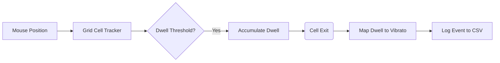

# GazeComposer-lite: Dwell-based Grid + Vibrato Mapping (Research Skeleton)

## Note on Reproducibility

This repository exposes a minimal, self-contained version of the dwell-based vibrato mapping
logic used in my larger GazeComposer project. To protect ongoing IP and performance code, the
full gaze-tracking and audio engine are not included here; instead, this repo focuses on the
experimental core and logging pipeline so that the mapping and analysis can be inspected and
reproduced.


To protect ongoing patent work and a larger private codebase, this repo does **not** contain the full gaze-tracking implementation or the complete performance environment. Instead, it exposes:

  - A simplified **5×10 pitch grid**
  - A **dwell-time based note selection** mechanism
  - A toy **dwell → vibrato-depth mapping** function
  - **CSV logging** architecture for offline analysis

In this demo, a **mouse cursor stands in for gaze**. The goal is **not** to simulate the biomechanics or jitter of human eye movements, but to make the **mapping functions and data pipeline** used in my pilot study transparent and reproducible in a simple environment.

-----

## 1\. Concept

The goal of this demo is to make the **experimental logic** of my work reproducible:

1.  A 2D grid acts as a simplified "gaze keyboard."
2.  When the pointer **dwells** in a cell longer than a selection threshold, that cell is considered "activated."
3.  The **total dwell duration (ms)** is mapped to a **vibrato depth parameter** using different "presets":
      * `baseline`: No vibrato.
      * `vib_cons`: Conservative; shallow vibrato appears only on longer dwells.
      * `vib_aggr`: Aggressive; rapid vibrato growth with dwell time.
4.  When the pointer **leaves the cell**, a **note event is logged** containing the final accumulated dwell time and the corresponding vibrato parameters.

This demo answers the question:

> *“How does dwell time on a grid cell mathematically translate into a pitch and a vibrato depth parameter, and how is that data captured?”*

-----

## 2\. Requirements

  * **Python 3.10+** is recommended.
  * **Dependencies:**
    ```bash
    pip install opencv-python numpy
    ```

*Note: MIDI/sound output is intentionally omitted in this lite version to minimize dependencies. This repo focuses on logic and logging.*

-----

## 3\. Usage

Run the demo from the command line:

```bash
python demo_grid_vibrato_lite.py --preset baseline --run-id test01
```

### Options

  * `--preset {baseline, vib_cons, vib_aggr}`: Selects the dwell→vibrato mapping profile.
  * `--run-id RUN_ID`: A string label (e.g., participant ID) used in the log file name.
  * `--duration SECONDS`: Maximum duration of the session (default: 120s).

### Interaction

1.  Move your mouse cursor over the grid.
2.  **Activation:** When the cursor stays inside one cell longer than the threshold, the cell lights up.
3.  **Accumulation:** While you hold the cursor there, dwell time accumulates (visualized in the window).
4.  **Logging:** When you **exit** the cell, a note event is saved to CSV with the *total* dwell duration and calculated vibrato values.
5.  Press `q` to quit at any time.

-----

## 4\. Logged Data

Each session creates a CSV file in the current directory:
`events_<run_id>_<timestamp>.csv`

Each row corresponds to one complete cell visit (Entry → Threshold Pass → Exit).

| Column | Description |
| :--- | :--- |
| `ts_ms` | Event timestamp in milliseconds (at the moment of exit) |
| `run_id` | Label passed via `--run-id` |
| `preset` | Mapping preset used (`baseline`, `vib_cons`, etc.) |
| `row`, `col` | Grid indices of the selected cell |
| `cell_id` | Flattened cell index (`row * n_cols + col`) |
| `dwell_ms` | **Total dwell duration** in ms (from entry to exit) |
| `vib_depth` | Mapped vibrato depth (0.0–1.0) based on the final `dwell_ms` |
| `vib_rate_hz` | Mapped vibrato rate in Hz (toy mapping) |
| `note_pitch` | MIDI-like integer pitch (for analysis) |

**Note:** In the full real-time system, vibrato depth evolves continuously. Here, we log the *final* parameters upon exit to simplify the analysis of "dwell-to-parameter" relationships.

-----

## 5\. Architecture (Lite Version)

The data flow in this demo mirrors the experimental pipeline:



In the full system, **Mouse Position** is replaced by **Calibrated Gaze Coordinates** (webcam-based), and the parameters modulate a real-time audio engine instead of just logging.

-----

## 6\. Core Algorithms

This repository exposes the structural subset of the algorithms used in `GazeComposer`.

### Included in Lite Demo

  * **Dwell-Based Fixation Detection:**
      * Tracks continuous presence within a grid cell.
      * Filters out transient movements (dwells \< threshold).
      * Captures total duration upon exit.
  * **Dwell → Vibrato Mapping:**
      * Maps `dwell_ms` to `[0.0, 1.0]` using piecewise/compressive curves.
      * Demonstrates how different presets (`vib_cons`, `vib_aggr`) alter the expressive output for the same physical action.

### Excluded (Private Codebase)

The full system additionally implements:

  * **2D Polynomial Gaze Calibration:** Least-squares regression from iris ratios to screen coordinates.
  * **Trajectory Smoothing:** One-pole IIR low-pass filtering with outlier rejection:
    $$g_t = (1 - \alpha) \cdot g_{t-1} + \alpha \cdot g_t^{raw}$$
  * **Regularized Curve Fitting:**
      * Prototype scripts (outside this repo) use **regularized least-squares (“ridge-style”) curve fitting** to mathematically tune the preset curves, ensuring they meet specific expressive criteria while preventing parameter explosion.
      * The presets in this repo are manually set to approximate those fitted curves.

-----

## 7\. Relation to the Full System

This repository serves as a **research skeleton** for reviewers to verify:

1.  How dwell-based selection is architected.
2.  How the mapping logic handles variable dwell times.
3.  How interaction data is structured for quantitative analysis.

It abstracts away the gaze tracking pipeline (OpenCV/MediaPipe) and the audio synthesis engine, in order to focus purely on the Mapping & Logging layer.

-----

## 8\. Example Analysis

The logs are designed for immediate analysis in Python/Pandas. You can reproduce the pilot study's summary statistics (e.g., "Does the Aggressive preset lead to shorter dwell times due to faster vibrato onset?") using a simple script:

```python
import glob
import pandas as pd

files = sorted(glob.glob("events_*.csv"))
df = pd.concat([pd.read_csv(f) for f in files], ignore_index=True)

summary = (
    df.groupby("preset", as_index=False)
      .agg(
          events_total=("dwell_ms", "size"),
          dwell_ms_mean=("dwell_ms", "mean"),
          vib_depth_mean=("vib_depth", "mean"),
          # Calculate ratio of events with effectively zero vibrato
          vib_zero_ratio=("vib_depth", lambda x: (x.fillna(0) == 0).mean()),
      )
)

print(summary)
```

-----

## 9\. Limitations and Planned Analysis

This repository focuses on the **software architecture** of the mapping mechanism.

In my pilot work, I primarily used descriptive statistics to validate the mapping behavior. As part of my graduate studies, I plan to apply more formal statistical modeling to this data, such as:

  * **Mixed-Effects Models:** To analyze dwell time variations while treating 'Participant' as a random effect.
  * **Logistic Regression:** To model the probability of Vibrato Onset (`vib_depth > 0`) as a function of dwell duration and grid pitch height.
  * **Survival Analysis:** Treating "maintaining a dwell" as a time-to-event process to understand engagement decay.

These planned analyses build on roughly a year of self-study in linear algebra, probability, and introductory machine learning, and are intended to turn this pilot-style mapping exploration into a more rigorous experimental framework.


-----
